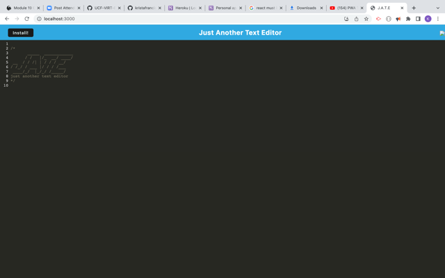
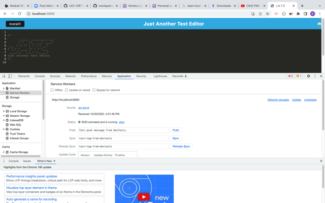

# Text-Editor
  ## Table of Contents
  * [Description](#description)
  * [Installation](#installation)
  * [Usage](#usage)
  * [Licenses](#licenses)
  * [Contributing](#contributing)
  * [Tests](#tests)
  * [Questions](#questions)
  * [Credits](#credits)
  ## Description
  A text editor that runs in the browser
   ,
   

  ## Installation
  Clone the repository from GitHub, then run npm i to install all the dependencies.
  ## Usage
  This is a single page application that can run in the browser or run offline.
  ## Licenses
 
    This project is covered under the MIT license. To learn more about what this means, click the license button at the top.
  ## Contributing
  Please contact me if you would like to contribute to this project.
  ## Questions
  Have questions about this project?  
  GitHub: https://github.com/kristafrancis  
  Email: kristafrancis08@yahoo.com
  ## Credits
  Krista Francis

[def]: images/sw.png